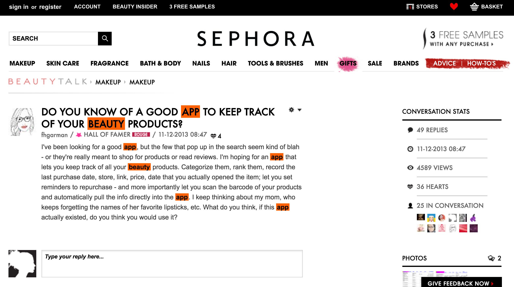
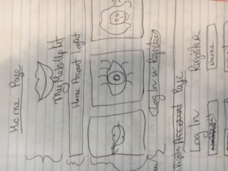

# MyMakeUpKit #

## Concept: ##
### We wanted to create a beauty app for girls which will help them to organize and keep track of their make up. We found a real request from customer on Sephora website asking if there was an app like that.###

##Technologies used:##
* HTML
* CSS
* Javascript
* jQuery
* json
* Ruby
* Sinatra
* Wav
* AudioControls
* Heroku

##Application Instructions##

## When the page loads, and you are ready to start, please click here or Account on nav bar and it will take you to LogIn/Register page. If you don't have an account please register. If you have one, please log in. After you log in or register it will take you to the page where you can start adding items to your make up kit. After you fill out the form for a product you can hit AddItem button. When you are done entering items, you can hit Check Out Your Beauty Kit button and it will take you to the page where all the items are displayed. If you want to see any product in details, please click on it and it will take you to the page where you can see all the info about this products. When you are done, please don't forget to log out.

## Future goals:##
##We want to make it look nicer, add more fun features and add a scan of a a product barcode. Also we want to send email alerts/reminders to customers when a product is about to expire to make sure they replenish or buy smth new.
